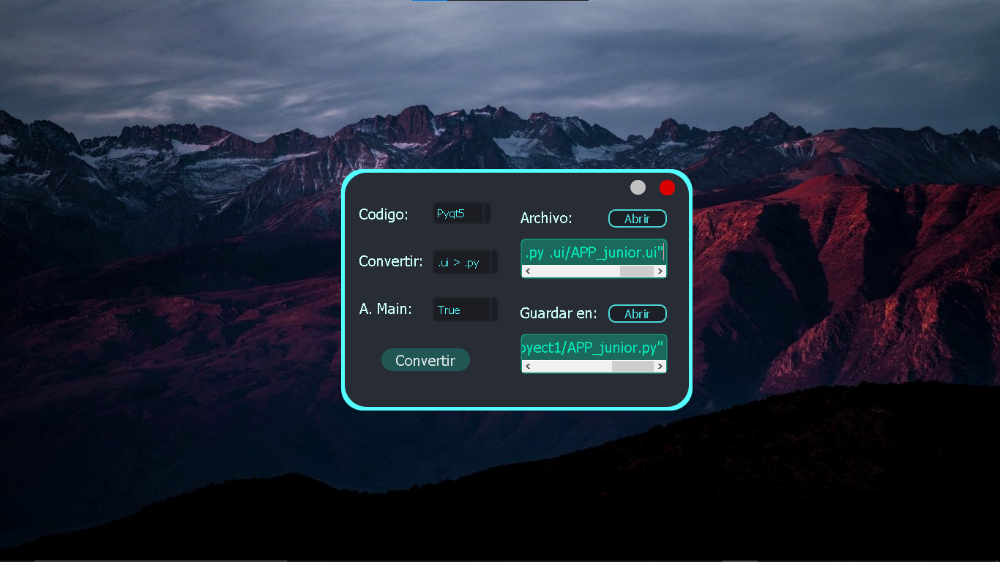

# PyQt5-ConvertidorArch
Project #2 with Python-PyQt5. Una herramienta sencilla para 
convertir archivos .ui a .py y tambien .qrc a .py.

archivo principal __main__.pyw, al ejecutar este archivo 
muestra las opciones disponibles que se muestra en este 
programa. 

Es importante saber que se nesesitan conocimientos basicos
en python y en la creacion de aplicaciones de pc con python
utilizando librerias pyqt o pyside, para poder adactar el 
codigo  esto con el objectivo que quede el programa funcionando 
en nuevas actualizaciones.

**Image 1**

<i>Best respect !!!</i>

**<cite>Author: Francisco Velez</cite>**
